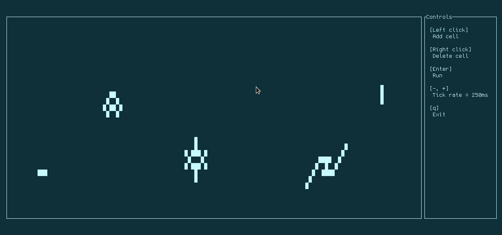

# rust-game-of-life
A terminal based Rust implementation of [Conway's game of life](https://en.wikipedia.org/wiki/Conway%27s_Game_of_Life).

The objective for this project was to learn how to use the `tui-rs` and `crossterm` libraries to later contribute to open source projects. I was also able to familiarise myself with Rust multithreading. The `main.rs` file is heavily commented to denote my thought process and interesting decisions I had to make along the way.

The next two things I'd like to implement to this are support for mouse dragging as a method for mass adding or deleting cells and finding some way to allow the user to set even faster tick rates without freezing the ui.
